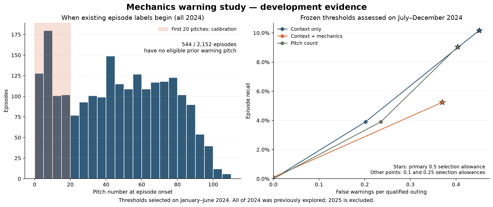

# MLB Pitcher Mechanics Stability Index

**Evidence status:** `outputs/real_data/` contains validated run `7f6d93243a7e47d3a78948198dce6f30` (protocol `bb4dcd5a4c431b74b20b93b9ff6ea5e6af09e5ea1ebcb52b60595efbdde9d59a`). The 40-pitcher rerun passed the artifact validator and persisted warehouse audit. The earlier run `08a3a0b1ccde4ff4a59b9a36690cd1a3` is archived locally because its ablation manifest belonged to a different protocol.

This project tests whether pitch-level mechanical drift is associated with a collapse episode in the next 15 pitches. The Mechanics Stability Index (MSI) is an inverse transform of Mahalanobis distance from a pitcher- and pitch-type-specific historical baseline. It is not a direct measure of fatigue, and this observational analysis does not establish causality.

## Frozen evaluation protocol

Real-data runs retrieve regular-season (`game_type = R`) Statcast pitches for the configured cohort and seasons. The primary experiment is:

| Partition | Dates | Use |
|---|---|---|
| Train | 2023 | Fit the contextual model; construct prior-only mechanics baselines |
| Validation/development | 2024 | Select feature rules, hyperparameters, and one operating threshold per model |
| Frozen test | 2025 | Report final comparisons using the frozen 2024 thresholds |

The prior experiment—2023 training, January–June 2024 validation, and July–December 2024 testing—is retained separately as `historical_2024_model_comparison.csv`. It is never combined with the primary 2025 result.

Important disclosure: exploratory 2025 metrics were generated in this workspace before the revised protocol was adopted. The current protocol is locked and leakage-safe in code, but the 2025 result should be described as a locked retrospective holdout evaluation, not a pristine first look. The generated `protocol_manifest.json` records this limitation, the frozen settings, thresholds, and a SHA-256 protocol hash.

## Eligibility and live-use limitation

The expanded cohort is fixed without using 2025 performance. The six original pitchers are retained, and 34 additional pitchers are selected with a recorded seed from players who made at least 30 MLB starts across 2023–2024. The downstream qualifier still requires 10 pre-test outings of at least 50 pitches. Starts completed during 2025 cannot determine selection or qualification.

The centralized settings in `config/config.yaml` are:

- at least 50 pitches in a qualified outing;
- a preselected cohort of 40 pitchers based only on 2023–2024 MLB records;
- 10 pre-test qualified starts for cohort membership;
- at least five completed prior starts before mechanics scoring;
- a rolling historical window of at most 12 prior starts; and
- at least 40 complete observations for a pitcher × pitch-type baseline.

The minimum prior starts is validated not to exceed the historical window. Cohort eligibility is separate from outing eligibility and pitch-type baseline sufficiency. The complete selection pool, selection reason, seed, pitcher-season ingestion status, excluded pitchers, excluded outings, and unavailable score reasons are exported.

The ≥50-pitch outing filter is retrospective: final outing length is unknown during live prediction. Therefore, reported results apply to retrospectively qualified starter outings and do not directly establish live performance for short starts, openers, or relief appearances.

## Mechanics baselines and alert isolation

Means and covariance matrices are estimated separately for each pitcher × pitch type before each outing. Any pitch type with enough completed historical observations can be scored; the `is_primary_pitch_type` descriptor does not gate scoring. During 2025, a baseline may update only with qualified outings on strictly earlier dates. Same-day and future outings are excluded from the baseline cutoff.

The configured first 20 pitches are calibration-only. They receive no Mahalanobis score, MSI, CUSUM update, or warning. Missing features, insufficient prior starts, insufficient pitch-type observations, and insufficient calibration are explicit unavailable states. The resolved calibration length and MSI decay parameter are recorded in the run manifest.

Behavioral tests verify that:

- every baseline source date precedes its scoring cutoff;
- changing future games cannot change earlier baselines, scores, or warnings;
- changing outcome-label columns cannot change mechanics scores or warning times;
- pitches 1–20 cannot score or update CUSUM;
- unavailable scores remain excluded;
- 2025 data cannot affect 2023 training or 2024 threshold selection; and
- changing pitch-selection proportions while holding within-type mechanics stable does not unexpectedly change the combined CUSUM warning rate.

## Fair model comparison

MSI+CUSUM, the contextual model, pitch count, and pitch-type-specific velocity drop use one authoritative population: every qualified outing in the evaluation split. An outing remains in the denominator when it has no available score; its collapse episodes remain eligible to count as misses, while unavailable pitches cannot generate warnings. Pitch- and outing-level score coverage are reported per model.

The one-to-one warning–episode matcher uses the configured matching horizon. Consecutive flagged pitches form one warning only when they are adjacent in the original within-outing pitch sequence. An unavailable pitch, a pitch-number gap, the calibration boundary, or an outing boundary breaks warning continuity; filtering unavailable rows never makes separated warnings adjacent.

Every model chooses its threshold on 2024 under an upper bound of 0.5 false warnings per outing—approximately one unmatched warning every two starts. The selected operating point is distinct from the allowance itself. Every validation candidate is exported and plotted, and the frozen operating point is shown on 2025 without retuning.

The CUSUM internal accumulation/diagnostic parameter, the validation-selected operating threshold applied to the CUSUM statistic, and the false-warning allowance are separate quantities. The dashboard and report load all three from the frozen run manifest and validate the displayed operating thresholds against the model-comparison artifact.

The velocity benchmark calculates four-seamer (`FF`), sinker (`SI`), and cutter (`FC`) drops independently and assigns scores by row index. A velocity risk ratio below one is not evidence that velocity is a lagging indicator.

## Shared evaluation contract

`src/evaluation/protocol.py` defines the common qualified-outing population before score filtering. Opportunities exclude calibration and incomplete follow-up. Model availability is a separate index-aligned Boolean mask; numeric scores must first be converted to a finite-value mask. Rows need unique indices and unique `(game_pk, pitcher, pitch_number_in_outing)` identities. The warning builder keeps starts on the original ordered sequence, including starts later censored from evaluation. An unavailable pitch, absent pitch number, calibration boundary, or outing boundary breaks a warning run. CUSUM retains its statistic across unavailable pitches; warning-event continuity does not reset detector state.

An onset matches only a strictly earlier warning no more than the configured horizon before it; warning and episode matches are one-to-one. Episode recall uses all eligible observed episodes in qualified outings, including scoreless outings. Precision uses matched evaluable warnings divided by all evaluable warnings. False warnings per outing uses unmatched evaluable warnings divided by all qualified outings. Clean-outing false-alarm rate uses clean outings with an evaluable warning divided by all clean outings. Pitch coverage uses available scoring opportunities over all protocol opportunities; outing coverage uses outings with at least one available opportunity over all qualified outings. A missing denominator is N/A (JSON `null`), whereas an observed miss is zero. Risk ratios with an absent exposure group are undefined; positive alert risk over zero comparison risk is infinite. A selected no-alert threshold has status `no_alert` and a null numeric threshold.

The configuration loader rejects obsolete aliases and validates parameter bounds. Manifest schema version 2 contains a run ID, deterministic protocol hash of resolved settings, thresholds, and source/configuration digest, plus the source commit and dirty state. Timestamps and machine paths are outside the protocol hash. Derived CSV and gold warehouse artifacts carry both run and protocol IDs. Old manifest versions are rejected with a regeneration message. The output set is staged under `outputs/.staging/<run_id>` and validated before promotion; the warehouse batch and output-directory swap are separate operations, so a process failure between them can briefly leave different run IDs in those stores. The dashboard rejects mismatched identities. Simulation uses its own local warehouse under `data/simulation/`.

Run the offline production smoke test with `python -m pytest tests/test_offline_smoke.py -q -p no:cacheprovider`. Validate a completed output directory with `python scripts/validate_artifacts.py outputs/real_data`. A complete real-data rerun uses `python scripts/run_full_pipeline.py`; it requires the approved 2023-2025 Statcast cache or retrieval access. No paid cloud job is needed for ordinary CI.

The `refresh_ablation_outputs.py` and `refresh_lead_time_outputs.py` entry points run the full pipeline because isolated refreshes cannot safely mix artifact versions. The local DuckDB and Parquet warehouse is not included in Git; a fresh clone must run the pipeline before using the dashboard.

The exploratory CUSUM diagnostic reads the existing Parquet warehouse and compares fixed-reference CUSUM with a reference estimated separately for each feature variant from 2023 scores. Run `python scripts/diagnostics/check_cusum_pitch_count_correlation.py --variant all --shuffles 20`; use `--variant full` for the production score alone. Results are saved to `outputs/diagnostics/cusum_pitch_count_check.json`. Both versions select thresholds on 2024 under the same false-warning allowance and report the pitch-count baseline and within-outing correlations. The control shuffles available scores within each outing and pitch type, keeping the selected thresholds fixed. Shuffle ranges describe sensitivity to score order and are not confidence intervals or significance tests. The script filters out 2025 before loading rows and does not change production settings or warehouse tables. All reported performance is exploratory validation performance; a later test experiment must be frozen before evaluating 2025.

The 2026-10-01 diagnostic covers 956 qualified 2024 outings and 2,152 episodes, with 20 paired shuffle controls per variant. The full-feature training reference is mean `3.2207` and standard deviation `2.1116`, compared with the configured `1.0` and `0.5`. Under the configured reference, 99.58% of available post-calibration validation pitches increase CUSUM; under the empirical reference, 10.63% do. The original full-feature CUSUM is reproduced on every validation pitch, and each reconstructed episode count matches its persisted outing count.

| Feature variant | Original validation recall | Recalibrated validation recall | Original median within-outing correlation with pitch count | Recalibrated median correlation |
|---|---:|---:|---:|---:|
| Full suite | 10.22% | 8.27% | 1.000 | 0.106 |
| Velocity | 4.18% | 6.97% | 0.116 | 0.147 |
| Release point | 9.34% | 8.27% | 0.961 | 0.130 |
| Spin and movement | 8.69% | 3.11% | 1.000 | 0.061 |

Correlation summaries exclude outings with fewer than 10 evaluable scores or fewer than three distinct statistic values. For the recalibrated full suite, 805 outings contribute and 151 are excluded; all 956 contribute to the original full-suite correlation. All 956 outings remain in the performance denominators. The common false-warning allowance does not imply identical realized warning rates: full-suite false warnings decrease from `0.476` to `0.412` per outing, and precision decreases from 32.59% to 31.12%. Pitch count achieves 11.66% recall, 36.06% precision, and `0.465` false warnings per outing on the same validation population.

Shuffling the original full-suite scores produces median recall 10.04%, close to the observed 10.22%, while median precision falls from the observed 32.59% to 30.83% and median false warnings rise to `0.505` per outing. These descriptive results support the reference-mismatch concern and suggest that some timing information remains. Empirical centering substantially reduces accumulation with pitch count, but this pooled reference replacement does not improve the main detector. The results are development evidence from the threshold-selection split, not an independent test or a formal shuffle significance test; production settings and published 2025 results retain their existing protocol.

## Development label audit and incremental mechanics study

Run `python scripts/diagnostics/run_mechanics_value_study.py` to audit the existing episode definition and compare context alone with context plus five predefined mechanics features. Both logistic models use identical 2023 training pitches and identical scoring availability. The added features are current log mechanical distance, its trailing five-pitch-type-appearance mean, change from the previous five-position mean, historical velocity z score, and historical release-position/extension z magnitude. Mechanical outliers are clipped using training quantiles only; both models use training-fitted standardization. The balanced classifiers produce ranking scores, not calibrated probabilities.

Operating thresholds are selected on January–June 2024, then frozen before assessment on July–December 2024. The selector evaluates the union of 31 and 101 score quantiles under false-warning allowances of 0.1, 0.25, and 0.5 per outing. A pitch-count comparator uses the same availability, and every qualified outing and episode stays in the denominators. Paired pitcher bootstrap intervals quantify the context-plus-mechanics differences at the primary allowance of 0.5. This is a chronological development experiment: both halves of 2024 were previously inspected. It does not evaluate 2025 or alter production labels and settings.

Artifacts in `outputs/diagnostics/` use the `mechanics_value_` prefix: the plan saved before fitting, fitted model parameters, frozen thresholds, all threshold candidates, assessment comparisons, warning/match records, and bootstrap intervals. The label audit exports every episode's onset, confirmation time, duration, reasons, and eligible prior warning opportunities, plus a deterministic sample of review cases and their plate-appearance context. Cases are sampled without using model predictions and remain marked for baseball review. Render the saved report with `python scripts/diagnostics/plot_mechanics_value_study.py` to create `mechanics_value_summary.png`.

The completed audit covers 935 qualified 2023 outings and 956 qualified 2024 outings. In 2024, 909 outings (95.08%) contain at least one episode, with 2,152 episodes in total. The median episode lasts two plate appearances. There are 524 onsets during the first 20 calibration pitches, and 544 episodes (25.28%) have no eligible strictly earlier warning pitch within the 15-pitch horizon. These episodes remain in the primary recall denominator. Another audit flag identifies 255 onsets (11.85%) based on a two-PA window before the configured three-PA window is complete. All 2024 onset reasons include the xwOBA criterion. These findings call for baseball review of the endpoint; episode frequency alone does not establish whether an episode represents sustained deterioration.

Onset is assigned to the first pitch of the PA that completes a bad rolling outcome window; its outcome is confirmed at that PA's last pitch. The median confirmation delay is three pitches. The review export contains 23 cases selected independently of model predictions. For example, Joe Musgrove's March 21, 2024 episode begins at pitch 7, during calibration and after only two PAs. Luis Severino's August 17, 2024 case consists of one flagged PA: a hit-by-pitch raises the rolling blended xwOBA above the cutoff following a double and a field out; a subsequent strikeout ends that episode. These examples illustrate timing and duration issues for review, rather than verified fatigue diagnoses. Case assessments remain pending in [the review sample](outputs/diagnostics/mechanics_value_review_cases.csv), with [the surrounding PA outcomes](outputs/diagnostics/mechanics_value_review_pa_context.csv).

The July–December 2024 assessment contains 446 qualified outings and 973 episodes. The following operating points use thresholds frozen on January–June 2024 under the primary selection allowance of 0.5 false warnings per outing. Each model has the same 27,900 available evaluation pitches (98.55% coverage) and retains all 446 outings and 973 episodes in the denominators.

| Model | Detected episodes | Episode recall | Warning precision | False warnings per outing |
|---|---:|---:|---:|---:|
| Context only | 99 | 10.17% | 33.00% | 0.451 |
| Context plus mechanics | 51 | 5.24% | 23.61% | 0.370 |
| Pitch count, same availability | 88 | 9.04% | 32.84% | 0.404 |

Adding the predefined mechanics features reduces recall by 4.93 percentage points (paired pitcher bootstrap 95% interval: −6.26 to −3.52) and precision by 9.39 points (−13.64 to −5.04). It also reduces false warnings by 0.081 per outing (−0.135 to −0.022). The intervals use 1,000 paired replicates across 35 pitchers. The actual warning burdens differ, so this comparison does not estimate a benefit at exactly equal false-warning rates. This fixed linear feature bundle did not demonstrate incremental detection value at its selected operating points; it does not rule out value from other mechanics features or models. Endpoint review should precede another model-selection cycle. Full counts, censoring, thresholds, and intervals are in [the saved report](outputs/diagnostics/mechanics_value_report.json).



## Uncertainty and lead time

Paired bootstrap intervals resample the same complete qualified 2025 outings used by the headline evaluator and use identical sampled outings for every model. Frozen thresholds are never reselected within bootstrap samples. The output reports 95% intervals for episode recall, warning precision, false warnings per outing, risk ratio, and direct proposed-minus-comparator differences. Zero-denominator replicate frequency is reported explicitly, and bootstrap point estimates are tested against the ordinary evaluator before resampling.

A pitcher-clustered sensitivity analysis resamples pitchers and includes all their outings. Per-pitcher results are exported so pooled performance can be checked for dependence on a few pitchers.

The fixed-warning lead-time experiment holds scores, thresholds, and warning times constant while changing only the match horizon across 10, 15, 20, and 25 pitches. It reports follow-up coverage, censoring, a common-follow-up comparison, matched warning–episode records, and lead-time distributions. Improved recall under a wider window alone is not proof of earlier predictive value.

## Scientific interpretation and findings

The validated 2025 retrospective test contains 708 qualified outings and 1,581 evaluable collapse episodes. The proposed model detected 154 episodes (9.74% recall), made 462 evaluable warnings (33.33% precision), and produced 308 unmatched warnings (0.435 per outing). The full-feature ablation reproduces these numbers under the same frozen threshold.

The proposed-minus-contextual confidence intervals for recall and precision include zero. Compared with traditional pitch count, the proposed model has lower recall by 0.01455; the outing-bootstrap 95% interval is [-0.02886, -0.00128], while the pitcher-clustered interval is [-0.03080, 0.00123]. The interpretation therefore depends on the resampling unit. The proposed risk-ratio estimate is 1.050, with intervals that include 1.0. See `bootstrap_confidence_intervals.csv` and `model_comparison.csv` for the complete comparisons and undefined-denominator frequencies.

These results do not demonstrate additional predictive utility over simple contextual or workload baselines. Mechanical deviations do not establish biological fatigue, injury risk, or a causal mechanism. Exploratory 2025 results were examined before this revised protocol, so this is a locked retrospective holdout analysis rather than a pristine first look.

## Provenance and warehouse integrity

Every persisted result records its actual source (`mlb_statcast` or `simulation_benchmark`). Real-data retrieval is strict: a failed segment aborts publication. A zero-row pitcher-season is accepted only when the official MLB season record independently confirms that the pitcher threw no regular-season pitches. Simulation is available only through explicit `use_real_data=False` mode.

Before publication, the pipeline checks requested seasons, source consistency, regular-season scope, pitch-key uniqueness, raw-to-qualified referential integrity, gold fact alignment, and 2025 test assignment. DuckDB tables and Parquet files are replaced atomically and reloaded for a second audit.

Real and simulation evidence are written separately:

- `outputs/real_data/`
- `outputs/simulation/`

The real-data directory contains the protocol manifest, metrics, model comparisons, paired confidence intervals, threshold candidates and plot, lead-time analyses, exclusions, missing-data summary, case evidence, ablations, sensitivity reruns, and warehouse audit.

## Run locally

```bash
python -m venv .venv
# Windows: .venv\Scripts\activate
# macOS/Linux: source .venv/bin/activate
pip install -r requirements.txt
python -m pytest tests -v
python scripts/prepare_expanded_cohort.py
python scripts/run_full_pipeline.py
python scripts/validate_artifacts.py outputs/real_data
python scripts/audit_warehouse.py
streamlit run dashboard/app.py
```

For an explicitly synthetic run:

```python
from scripts.run_full_pipeline import run_pipeline
run_pipeline(use_real_data=False)
```

## Run on GCP from GitHub

The cloud path uses two manual Cloud Run Jobs so a long evaluation does not
lose the expensive Statcast download. `baseball-prepare` freezes the cohort,
downloads/validates every pitcher-season, and checkpoints the raw cache in GCS.
`baseball-evaluate` restores that checkpoint, runs the canonical pipeline,
performs the warehouse integrity audit, and publishes Parquet results to GCS
and tables to BigQuery. Cloud publishing is strict: a failed GCS or BigQuery
write fails the job rather than silently claiming success.

In Google Cloud Shell, select the free-trial project and pull this repository:

```bash
gcloud config set project YOUR_PROJECT_ID
git clone https://github.com/jimmywu0515-wq/baseball_competition.git
cd baseball_competition
bash scripts/deploy_gcp.sh
```

Deployment does not start compute. Run the stages explicitly, in order:

```bash
gcloud run jobs execute baseball-prepare --region=us-central1 --wait
gcloud run jobs execute baseball-evaluate --region=us-central1 --wait
```

Or deploy and execute both with `bash scripts/deploy_gcp.sh --run`. The prepare
job is resumable and subsequent executions reuse validated GCS cache objects.
The evaluation job is capped at one task, zero retries, 2 vCPU, 8 GiB, and six
hours to bound accidental spend. This uses free-trial credits; it is not
guaranteed to remain inside every GCP free-tier allowance. Configure a billing
budget/alert before the first run, and do not add a schedule while experimenting.

Useful checks:

```bash
gcloud run jobs executions list --job=baseball-evaluate --region=us-central1
gcloud storage ls gs://YOUR_PROJECT_ID-baseball-lakehouse/results/real_data/
bq ls YOUR_PROJECT_ID:baseball_analytics
```

## Archived evidence and reproducibility checklist

The current verified run selected 40 pitchers and audited 267,983 cached raw pitches. The qualifier retained 237,156 pitches across 2,599 outings.

The verified 2025 comparison selected a proposed threshold of `211.9586` on 2024 validation, then evaluated 708 qualified outings and 1,581 observed episodes. It reports episode recall `0.096774`, warning precision `0.332609`, and `0.433616` false warnings per outing. These observational results retain the prior-2025-exposure disclosure. Subset ablations remain unavailable when historical covariance baselines are absent.

### Milestone tracking

| Milestone / Component | Primary Artifacts | Status | Acceptance & Verification Protocol |
| :--- | :--- | :---: | :--- |
| **1. Deterministic Cohort Selection** | `outputs/cohort_expansion/selection_pool.csv` | **Completed** | Pre-test selection seed `20250917`, >=30 MLB starts in 2023–2024, retaining original 6 pitchers. |
| **2. Statcast Ingestion & Verification** | `outputs/cohort_expansion/ingestion_segments.csv` | **Completed** | 120 segments audited (115 loaded, 5 verified zero-pitch seasons via official MLB Stats API). |
| **3. Resumable GCP Cloud Architecture** | `scripts/deploy_gcp.sh`, `scripts/cloud_entrypoint.py` | **Cloud verification pending** | Dual-stage Cloud Run Jobs and GCS checkpointing exist; publication still needs a release-wide consistency audit. |
| **4. Vectorized Event-Matching Pipeline** | `src/evaluation/protocol.py`, `src/anomaly_scorer/` | **Completed** | Vectorized CUSUM/Mahalanobis scoring eliminating downstream evaluation bottlenecks. |
| **5. Full 40-Pitcher Pipeline Execution** | `scripts/run_full_pipeline.py` | **Completed** | Run `7f6d93243a7e47d3a78948198dce6f30` passed the current artifact validator. |
| **6. Warehouse Audit & Integrity Gate** | `outputs/real_data/warehouse_integrity_report.csv` | **Passed** | The persisted warehouse audit found zero duplicate pitch keys and zero qualified orphans. |
| **7. Production Metrics Promotion** | `outputs/real_data/metrics_summary.json` | **Completed** | Staged artifacts were validated before the real-data directory was promoted. |

---

### Step-by-step reproduction protocol

#### Step 1: Deploy & verify GCP infrastructure
Deploy the dual-stage serverless pipeline to your GCP project:
```bash
# In Google Cloud Shell:
gcloud config set project YOUR_PROJECT_ID
bash scripts/deploy_gcp.sh
```
*Verification criteria:*
- Cloud Run Jobs `baseball-prepare` (1 vCPU, 4 GiB) and `baseball-evaluate` (2 vCPU, 8 GiB) deployed.
- Service account `baseball-pipeline-runner` bound to `roles/storage.objectAdmin` and `roles/bigquery.dataEditor`.
- BigQuery dataset `baseball_analytics` and GCS bucket `gs://YOUR_PROJECT_ID-baseball-lakehouse` provisioned.

#### Step 2: Execute data preparation & model evaluation
Execute the two decoupled stages (or run both sequentially with `--run`):
```bash
# 1. Download & checkpoint Statcast cache in GCS (resumable upon retry):
gcloud run jobs execute baseball-prepare --region=us-central1 --wait

# 2. Restore cache, run canonical holdout evaluation, bootstrap & ablations:
gcloud run jobs execute baseball-evaluate --region=us-central1 --wait
```
*Alternatively, execute locally on workstation:*
```bash
python scripts/prepare_expanded_cohort.py
python scripts/run_full_pipeline.py
```
*Verification criteria:*
- Execution completes within resource bounds (evaluation job capped at 6h, 0 retries).
- Vectorized event matching processes all ~268k observations without memory exhaustion.

#### Step 3: Audit warehouse integrity and data provenance
Verify data consistency across all Medallion layers:
```bash
python scripts/audit_warehouse.py
# Or inspect BigQuery tables:
bq query --use_legacy_sql=false 'SELECT * FROM `baseball_analytics.warehouse_integrity_report`'
```
*Verification criteria:*
- `warehouse_integrity_report.csv` confirms all required seasons (2023, 2024, 2025) present with 0 missing required columns.
- Referential integrity check confirms 100% of qualified pitches map cleanly to raw Statcast keys.
- No unverified empty segments exist.

#### Step 4: Validate and publish regenerated metrics
After a successful rerun:
1. Validate that `mart_model_evaluation` and `metrics_summary.json` reflect the 40-pitcher cohort size (`cohort_size: 40`).
2. Confirm bootstrap point estimates match the ordinary evaluator and dashboard thresholds match `protocol_manifest.json`.
3. Synchronize outputs to BigQuery and launch the dashboard, which reads thresholds and model results directly from the frozen artifacts.

## Main modules

- `src/configuration.py`: centralized configuration validation
- `src/data_ingest/`: strict Statcast retrieval, caching, and pre-test cohort qualification
- `src/baseline_builder/historical_baseline.py`: pitcher × pitch-type, pre-outing baselines
- `src/evaluation/protocol.py`: splits, eligibility, event matching, and threshold curves
- `src/evaluation/baseline_comparator.py`: frozen-threshold model comparison
- `src/evaluation/bootstrap.py`: paired outing and pitcher-clustered confidence intervals
- `src/evaluation/lead_time.py`: fixed-warning horizon sensitivity
- `scripts/run_full_pipeline.py`: canonical local pipeline
- `scripts/run_cloud_elt.py`: canonical pipeline plus cloud publication
- `scripts/cloud_entrypoint.py`: durable prepare/evaluate stage controller
- `scripts/deploy_gcp.sh`: one-command GCP infrastructure and Cloud Run deployment
